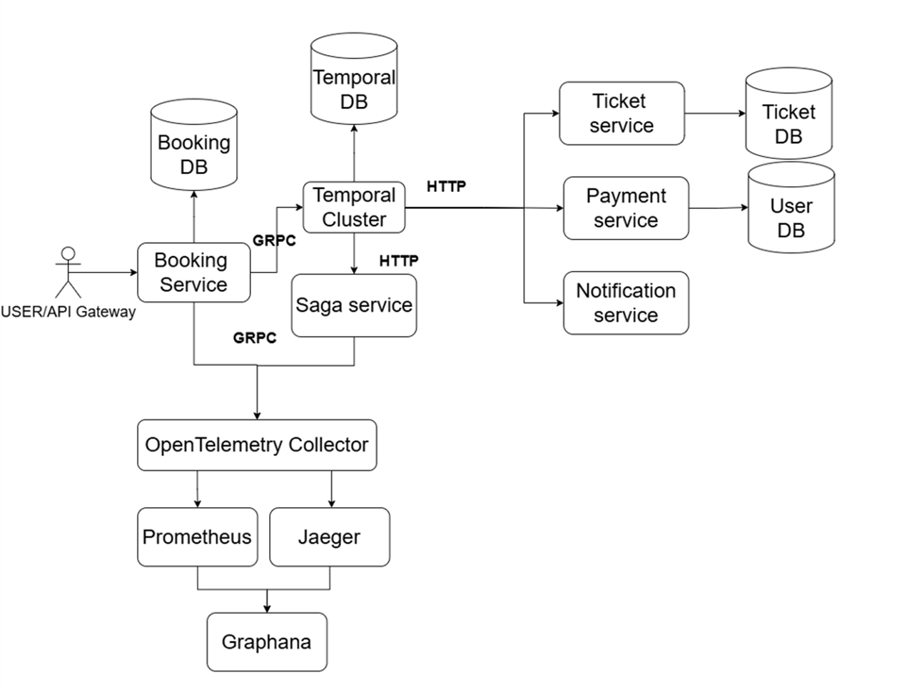

# TICKET BOOKING APP
Микросервисное приложение для бронирования билетов с поддержкой распределённых транзакций и системы наблюдаемости.

## Стек технологий

- Go
- PostgreSQL
- Docker / Docker Compose
- OpenTelemetry
- Prometheus + Grafana
- Jaeger
- Temporal (Saga)
- K6

### Запуск программы 
Для запуска микросервиса поднимите сначало все конетейнеры, затем выполните миграции для баз данных
```
make up
make db-up
```

## Архитура проекта

Архитектура микросервисного приложения построена вокруг `booking-service`, выступающего в роли точки входа через API Gateway. Для управления распределёнными транзакциями используется `Temporal` и паттерн Saga, координирующий взаимодействие между: `payment-service`, `notification-service` и `ticket-service`. Все микросервисы взаимодействуют по HTTP и интегрированы с OpenTelemetry Collector, который агрегирует метрики и трассировки. Данные наблюдаемости передаются в `Prometheus` и `Jaeger`, а визуализируются через `Grafana`, обеспечивая полную картину состояния системы и её производительности в реальном времени.